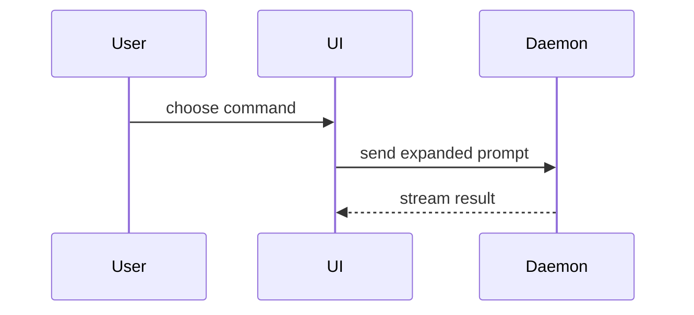

# PR body

Use this template for the PR body:

```markdown
## Summary

<one or two sentences: what changed and why>

<diagram, diff-sketch, or tree>

## Evidence

- **Gate:** `<command>`: <passed, failed, or skipped, and why>
- **Driven:** `<command>`: <what it showed, or not driven, and what to check by hand>
- <optional: **Before:** output or failing test run>
  <optional: **After:** output or passing test run>

## Merge Danger

**Door:** <one-way or two-way>

<optional: description>

**Blast Radius:** <none, local, consumers, or data>

<optional: potential ramifications of merge>
```

## Sections

Skip all preambles and keep prose brief. Use the domain language the project already uses.

### Summary

Pick the smallest view that makes the key point clear.

- Show logic or an algorithm as pseudocode:

```text
on(save)
  if content is unchanged
    return cached result
  write new content
  return fresh result
```

- Show runtime control flow as a call tree:

```text
submitForm
  createSession
    persistPrompt
    launchAgent
  navigateToSession
```

- Show UI structure as a component tree, including state and module boundaries that matter:

```text
<SessionPage> (apps/example/src/routes/session.tsx)
  useSessionEvents()
  <SessionToolbar>
    <RunSkillButton> (packages/ui)
```

- Show file responsibility or a broad refactor as a shallow file tree:

```text
src/
├── commands/       # parses user actions
├── sessions/       # owns session state
└── transport/      # sends API requests
```

- Show component interaction, control flow, or data flow with Mermaid:



- Use `diff` when the point is what changes and the surrounding shape already exists. Any of the shapes above works as a diff:

```diff
 on(save)
-  write content
+  if content is unchanged
+    return cached result
+  write new content
+  invalidate cache
```

- Show the whole block when most of it is new, when omitted context would hide ownership or order, or when the reviewer needs a copyable target shape:

```ts
function expandSkill(command: string): string {
  const skillName = command.slice(1);
  return `use the ${skillName} skill`;
}
```

Place each visual next to the short text it supports. Keep only the calls, files, props, states, and boundaries the reviewer needs to see the change.

You may use one of these, you may use several, it is unlikely you will use all of them.

### Evidence

List every gate with its command and its result, then every command that drove the change by hand with what it showed.

`worktree-flow:worktree-review` owns the **Review** line of this list: it adds the line after the last review.

Add a before and after pair where the change has an effect a reviewer can see. Execution-based evidence is the strongest: test results, console output. Show the exact test that failed before and passes now, as pseudocode. Add a screenshot only where the project has a place to host the image; `gh` cannot upload one into a PR body.

### Merge Danger

Say whether the merge is a one-way or a two-way door. Changes that involve destructive actions or hard-to-reverse decisions are one-way doors.

The blast radius is the widest thing the merge can break:

- `none`: no behavior changes, for example docs or comments.
- `local`: only the changed module and its own callers in this repository.
- `consumers`: anything that installs, imports, or calls this project.
- `data`: stored data, a schema, or anything a rollback does not restore.

Name the ramifications on the optional line below it.
